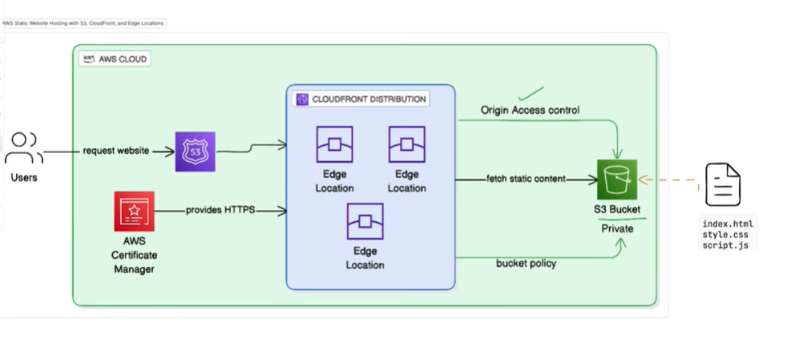

## CloudFront

**AWS CloudFront** is a Content Delivery Network (CDN) that improves application performance by caching content closer to users at AWS edge locations.

When we configure Cloudfront we create below:

CloudFront sits in front of an origin, such as an Amazon S3 bucket, an Application Load Balancer (ALB), an EC2 instance, or an API Gateway. When a user sends a request, CloudFront first checks whether the requested content is available in its edge cache. If the content is cached, it is returned immediately, reducing latency and the load on the origin. If it is not cached, CloudFront retrieves it from the origin, returns it to the user, and caches it according to the configured cache behavior.

* **Origin** – The backend source from which CloudFront fetches content (for example, S3, ALB, or API Gateway).

| Origin                       | Supported | OAC Applicable? |
| ---------------------------- | --------- | --------------- |
| Amazon S3                    | ✅         | ✅ Yes        |
| ALB                          | ✅         | ❌ No         |
| NLB                          | ✅         | ❌ No         |
| EC2                          | ✅         | ❌ No         |
| API Gateway                  | ✅         | ❌ No         |
| Lambda Function URL          | ✅         | ❌ No         |
| MediaPackage / MediaStore    | ✅         | ❌ No         |
| Any public HTTP/HTTPS server | ✅         | ❌ No         |

* **Origin Access Control (OAC)** – Used with S3 origins to allow CloudFront to securely access a private S3 bucket using SigV4 signed requests. We don't want to publicly expose the S3 to end user. 

OAC is applicable only for Amazon S3 origins.The S3 bucket policy allows access only from the CloudFront distribution.

* **Origin ID** - Unique identifier of the origin, used when we create cacahe behavior for multiple origins.
* **Default Cache Behavior** – Defines how requests are handled by default, including the target origin, allowed HTTP methods, cache TTLs, viewer protocol policy, and other caching settings.

    allowed_methods  = ["GET", "HEAD", "OPTIONS"] **Receive and forward all the listed request method**
    cached_methods   = ["GET", "HEAD", "OPTIONS"] **Cache only specifed methods**
    target_origin_id = local.s3_origin_id **origin ID associated with the target origin**

    forwarded_values {
      query_string = false 
      /*Helps to avoid unecessary caching of the content by ignoring query string like /style.css or .image.png. 
      If the response is based on query string like /books?category="romcom" query string must be true. Otherwise wrong data will cached and returned*/

      headers      = ["Origin"] -> stores origin in the header. As there is a case where application response varies based on the origin.

      cookies {
        forward = "none"
      }
    }
_______________________________________________________________________

cacahe-control is passed from origin -> 

Client
   │
   ▼
CloudFront
   │ Cache Miss
   ▼
Origin (S3 / ALB / API)
   │
   │ HTTP Response
   │ Cache-Control: max-age=3600
   ▼
CloudFront
   │
   ├── Checks:
   │     min_ttl
   │     default_ttl
   │     max_ttl
   │
   ▼
Stores object in cache

min_ttl     = 0
default_ttl = 3600
max_ttl     = 86400
Origin Cache Header	CloudFront Cache Time
No cache header	1 hour (default_ttl)
Cache-Control: max-age=10	10 seconds (allowed because it's above min_ttl)
Cache-Control: max-age=7200	2 hours
Cache-Control: max-age=604800 (7 days)	24 hours (max_ttl)

compress               = true -> If client supports we can compress the response of files like html, css, json, txt using Gzip or Brotli. ✅ Faster page loads ✅ Less bandwidth usage ✅ Better user experience
viewer_protocol_policy = "redirect-to-https" -> http -> https
____________________________________________________________________________

* **Ordered Cache Behaviors** – Route specific URL path patterns (such as `/images/*` or `/api/*`) to different origins or apply different caching policies.
* **Viewer Certificate** – Configures HTTPS by using either the default CloudFront certificate or a custom ACM certificate for a custom domain.
* **Restrictions** - Restrictions helps to whitelist the edge user locations. To which cloudfront will serve.

Overall, CloudFront improves performance, reduces latency, decreases the load on the backend origin, and enhances security by integrating with features such as HTTPS, Origin Access Control, AWS WAF, and DDoS protection.

Cloudfront helps to serve contents from its cache near end user edge location. when our actual backend lives in a specific region but we have user across the globe. To reduce the latency on fetching contents we can keep cloudfront before our orgin like S3 bucket, ALB or API gateway. It will reduce cost by reducing the number cross region request by reducing backend interaction for each request.

### Features

Reduces latency by serving content from nearby edge locations.
✅ Reduces backend load because many requests are served from the cache.
✅ Lowers data transfer costs by reducing repeated requests to the origin.
✅ Improves scalability during traffic spikes.
✅ Keeps S3 buckets private when using OAC.
✅ Supports HTTPS with ACM certificates.
✅ Integrates with AWS WAF and AWS Shield for security.
✅ Supports path-based routing to multiple origins.
✅ Supports compression (Gzip/Brotli) for faster content delivery.
✅ Provides geographic restrictions and signed URLs/cookies for controlled access.

When we host our static website in S3 and have users across the globe
We must allow public access to our S3
Cost of getting objects from single region where s3 hosted is costlier when we have users across all the region the world.

Cloud front will helps to cache it for certain TTL(time to live) in the edge location of user where multiple user can fetch the files from th cache and AWS don't need to inetract with S3 everytime.

Cloud front will interact with S3 only when files are not availble in cache.
Only cloud front has access to S3 out bucket will be private.
Secured
costy effective

Create S3 bucket
block public access
create bucket policy to allow access from cloud front (using json or using IAM policy document ARN)
Add objects to S3(files)
Create clpud front distribution
SSL Certificate -> Configure ACM certificate
Route 53 -> Custom domain
CICD
multiple env
Advanced cloud front configuration
Cache invalidation
